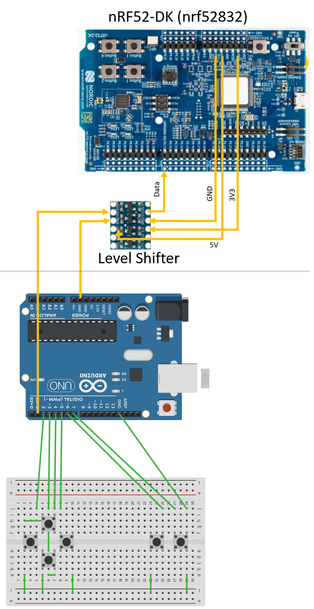

# DiyGameController
Kids project to breadboard a game controller

## Background
This project was developed for a community outreach program to introduce kids to basic elements of programming and 
electronics by building a game controller.

The design is split into two sections, the BLE-serial bridge and an Arduino Buttons-to-serial adapter, which the kids will build.

The BLE-Serial bridge is based on an nRF52-DK dev board that implements a BLE game controller.
This allows the controller to remain paired to a game (eg, NES emulator on phone or PC) while the kid's Arduino board can be connected, disconnected and generally messed around with to test out their circuits.

Comms between the nRF board and the Arduino are 2400 baud 8-N-1 serial, where each byte represents 8 buttons.
The input from the arduino should be level shifted and protected from anything a kid might do to it!

## Hardware

- nRF52-DK (could be ported to other nRF boards or ESP32 supported by Arduino-NimBLE)
- Arduino Uno (or similar)
- Level shifter (or just a resistor divider)
- Breadboard
- Tact switches
- Jumper wires

## Wiring

### Arduino
- Buttons: Pull-up inputs D2..D9
- Serial Tx: D1

### nRF52-DK
- Serial Rx: D0.11

## Programming

### Arduino
- Just use the plain ol [Arduino IDE](https://www.arduino.cc/en/software)

### nRF52-DK
- Use the [PlatformIO](https://platformio.org/) VSCode extension, all packages should be installed on build based on platformio.ini

## TODO

- Add unique IDs to advertised name